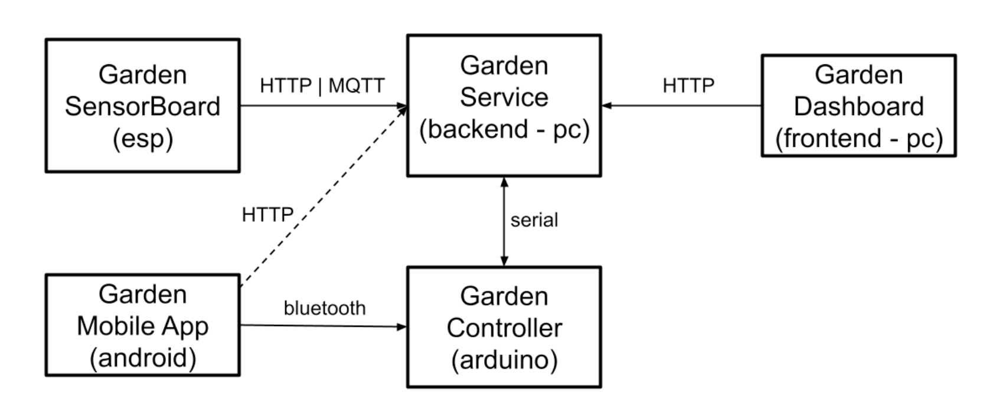

# Smart Garden

This is the third assignment for the Embedded System and IoT course of the Computer Science and Engineering Bachelor Degree @ 
UniBo.

## Project Overview
We want to realise an IoT system implementing a simplified version of a smart garden, i.e. a smart system monitoring and 
controlling the state of a garden.

The system is composed of 5 subsystems:

- **Garden SensorBoard (esp)**
    - embedded system to monitor the state of the garden by using a set of sensors
    - It sends the data to the Garden Service via MQTT
- **Garden Service (backend - pc)**
    - service functioning as the main control unit, governing the management of the garden
    - it interacts through the serial line with the Controller (arduino), via MQTT with the Garden SensorBoard (esp) and via HTTP 
with the Dashboard (frontend/PC)
- **Garden Controller (Arduino)**
    - embedded system controlling the irrigation system and lighting
    - it interacts via serial line with the Garden Service and via Bluetooth with the Mobile App, used by garden "operators"
- **Garden App (Android - smartphone)**
    - mobile app that makes it possible to manually control the irrigation system and lighting.
    - it interacts with the Garden Controller via Bluetooth
- **Garden Dashboard (Frontend/web app on the PC)**
    - front end to visualise and track the state of the garden
    - it interacts with the Garden Service to get the data

More details are available [here](./doc/Assignment#3-requirements.pdf).

Refers to the [report](./doc/report.pdf) for a short video demo, the breadboard circuits and the analysis of the system from a 
software point of view (with UML states and class charts).
