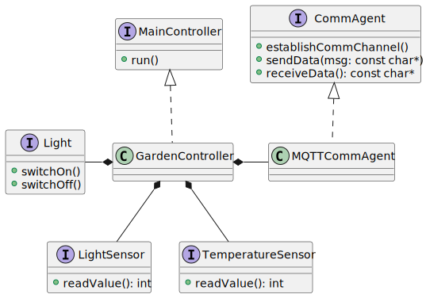
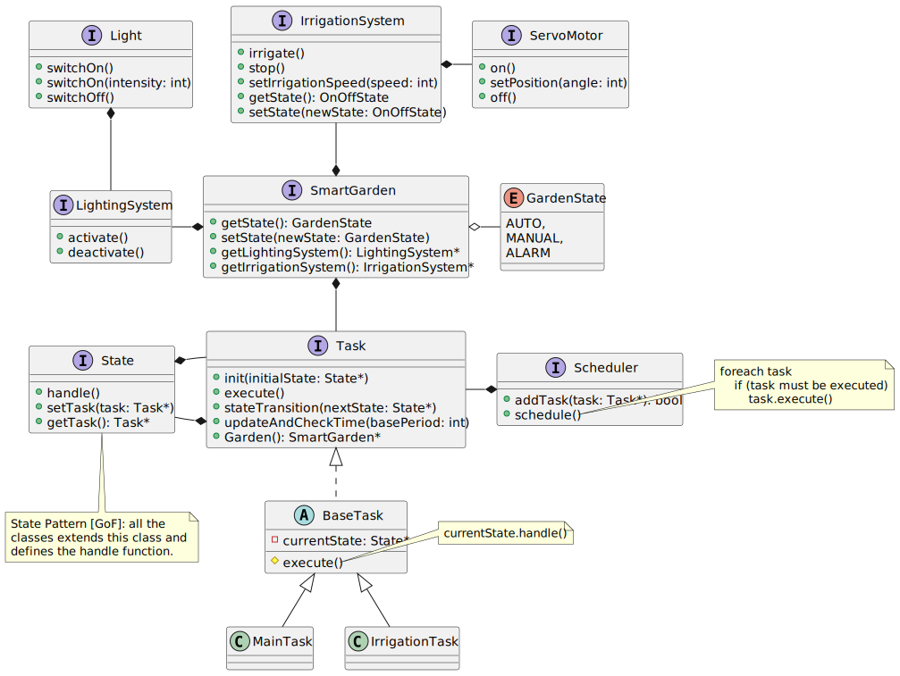
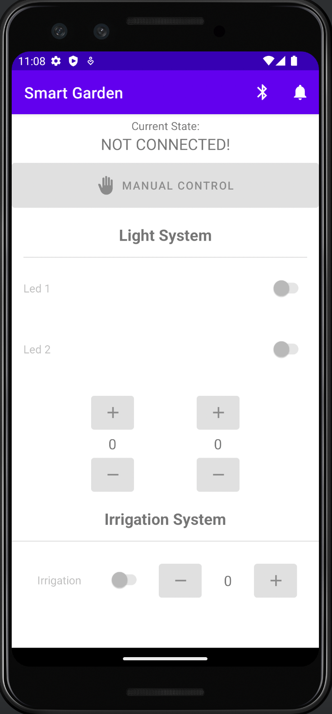

### Embdedded Systems and IoT - a.y. 21/22
# Assignment #3: Smart Garden Report

This is a short report explaining the modeling choices made along the development process of this assignment.

## Requirements
All the requirements of the system can be found [here](./Assignment#3-requirements.pdf).

## Demo
[Here](https://liveunibo-my.sharepoint.com/:v:/g/personal/luca_tassinari10_studio_unibo_it/EX-Ig3bdpuNIk-vLeKruPyUBDPZfhHCChchlniSAcjICQQ?e=BxL0gP) a short video demonstrating the logic of the system (hosted on restricted Unibo account).

## Design 
### Garden Sensor Board
The Garden Sensor Board (ESP) - as described in details in the requirements - is the component which monitors the state of the garden, reading and sending, through MQTT, the sensor data to the garden service app.

Below the schema of the circuit (made with Tinkercad):

The software has been conceived as follows and presented in the following UML schema:
- `CommAgent` is the agent, i.e. the active component, which exposes a general API in order to takes care of all comunication between the board and the outside world. This interface is implemented by a concrete `MQTTCommAgent` which encapsulate all the logic for connecting, sending and receiving messages through MQTT. This design follows the OCP principle: if it were necessary to communicate also via HTTP, it would be possible to simply add a new concrete implementation of the `CommAgent`.
- `MainController` is the controller of the board and exposes a `run()` method which is periodically called by the main. The concrete controller, the `GardenController`, foreach execution of the `run` method reads all the sensor status, serialize them inside a Json format, and delegates to the `MQTTCommAgent` to send the data.

### Garden Service
The garden service is the subsystem acting like a bridge between all other subsystems: it receives via MQTT the sensor data measured by the garden sensorboard and forward them through the serial line to the garden controller; moreover it store them in order to update the the garden dashboard when a new `GET` request has been performed.

### Garden Controller
The garden controller is the embedded sub-system which controls the irrigation system and the lighting one. 

It has been conceived using a **tasks-based architecture** and **synchronous Finite State Machines** with a **fully-static scheduler**. For this purpose have been developed 2 different tasks, with different level of abstractions: a **Main Task** and **Dispensing Task**.

The **Main Task** is the core task of the (sub-)system. It checks whether a new data has arrived, both via Serial line from the garden service or via bluetooth from the Android App. 
In both cases, when such an event happens, it reads the data and set up the system accordingly to them. 
Finally, it sends through the Serial line and blueetooth the new state of the garden in order to propagate the state info in the other sub-systems.

This task is executed every 500ms.

The **Irrigation Task** is the task which is responsible for the irrigation subsystem and is composed of only two states: `On` and `Off`. 
It's executed every 100ms.

**[NOTE 1]** the communication from the two tasks is achieved with a shared variable in which is stored the state of the irrigation system (in the source code this variable is encapsulated inside the `IrrigationSystem` class and exposed via a getter).

**[NOTE 2]** it could be implemented an another task which takes care of the lighting subsystem. However, for the actual requirements of the system, it's unnecessary (and would generate a lot of unnecessary boilerplate) because the (de)activation of the lighting subsytem is "atomic": is instantly executed when a new data arrive, differently from the irrigation system which requires to be continuosly updated even when no data is coming.

The OO organization of the code is described from the following UML diagram:

### Garden Mobile App
The mobile app makes it possible to manually control the irrigation system and lighting one interacting with the garden controller via Bluetooth.

### Garden Dashboard
It is a simply html page with linked a JS script which periodically sends an ajax `GET` request to the service to retrieve the last set of data (in Json format) and display them in a chart line, in addition to the garden state info.

